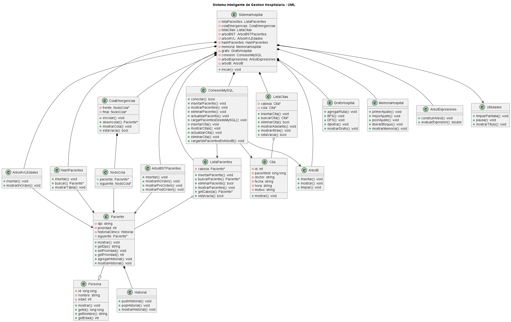

# 🏥 Sistema Inteligente de Gestión Hospitalaria

---

# 📌 DESCRIPCIÓN DEL PROYECTO

El Sistema Inteligente de Gestión Hospitalaria es una aplicación desarrollada en C++ orientada a la administración de pacientes, citas médicas, emergencias y simulaciones hospitalarias utilizando estructuras de datos avanzadas e integración con MySQL mediante PHP y XAMPP.

El proyecto fue desarrollado como parte del proceso de aprendizaje en Ingeniería en Sistemas, permitiendo aplicar conocimientos en:

- Programación Orientada a Objetos
- Estructuras de Datos
- Integración Backend
- Manejo de Bases de Datos
- Arquitectura Profesional en C++
- Diagramas UML

---

# 🛠️ TECNOLOGÍAS UTILIZADAS

| Tecnología         | Uso                   |
| ------------------ | --------------------- |
| C++                | Lenguaje principal    |
| MySQL              | Base de datos         |
| PHP                | Backend/API           |
| XAMPP              | Servidor local        |
| PlantUML           | Diagramas UML         |
| Visual Studio Code | Editor recomendado    |
| MinGW g++          | Compilador            |
| PowerShell         | Ejecución del sistema |
| Git                | Control de versiones  |
| GitHub             | Repositorio remoto    |
| Java JDK 21        | Soporte para PlantUML |

---

# 🧠 PROGRAMACIÓN ORIENTADA A OBJETOS

El sistema implementa principios de Programación Orientada a Objetos utilizando:

- Herencia
- Polimorfismo
- Encapsulamiento
- Modularidad

## 👨‍⚕️ Herencia

La clase `Paciente` hereda de la clase base `Persona`.

```cpp
class Paciente : public Persona
```

## 🔄 Polimorfismo

El sistema implementa polimorfismo utilizando punteros de tipo `Persona*`
que apuntan a objetos `Paciente`.

Esto permite reutilizar código y trabajar con diferentes tipos de objetos de forma más organizada, facilitando el mantenimiento y crecimiento del sistema.

---

# 🧩 ESTRUCTURAS DE DATOS IMPLEMENTADAS

## 1. Lista Enlazada

- Gestión dinámica de pacientes
- Gestión de citas médicas

## 2. Cola y Cola Priorizada

Utilizada para:

- Atención de emergencias
- Sistema de triaje hospitalario
- Organización automática por gravedad

## 🚑 SISTEMA DE TRIAJE HOSPITALARIO

| Prioridad | Nivel   |
| --------- | ------- |
| 1         | Crítico |
| 2         | Urgente |
| 3         | Normal  |

La cola reorganiza automáticamente a los pacientes según gravedad.

## 3. Árbol BST

- Organización y búsqueda eficiente de pacientes

## 4. Árbol AVL

- Balanceo automático de pacientes según edad

## 5. Tabla Hash

- Búsqueda rápida de pacientes

## 6. Grafo

- Simulación de rutas y áreas internas del hospital

## 7. Árbol de Expresiones

- Simulación de facturación hospitalaria

## 8. Árbol B

Utilizado para:

- Simulación de índices de pacientes
- Organización eficiente de IDs hospitalarios
- Carga dinámica de IDs desde MySQL

El Árbol B obtiene los IDs de pacientes desde MySQL utilizando integración entre:

- C++
- PHP
- MySQL
- XAMPP
- curl.exe

Los IDs de pacientes son obtenidos desde MySQL y almacenados dentro del Árbol B para simular el funcionamiento de los índices utilizados por los sistemas gestores de bases de datos.

## 9. Vector dinámico

Utilizado para:

- Almacenamiento temporal de edades
- Estadísticas hospitalarias
- Ordenamiento dinámico

---

# 🔄 ALGORITMOS IMPLEMENTADOS

## Búsqueda

- Búsqueda por ID
- Búsqueda Hash
- Búsqueda en árboles

## Ordenamiento

Se implementó Bubble Sort utilizando `vector<int>` para ordenar edades dinámicamente.

---

# 💾 PROCESAMIENTO DE ARCHIVOS

El sistema implementa procesamiento de archivos utilizando:

- ofstream
- fstream

Permitiendo:

- Exportar pacientes
- Generar archivos TXT
- Persistencia local

Archivo generado:

```text
pacientes_exportados.txt
```

---

# 🗄️ PERSISTENCIA DE DATOS

El sistema implementa persistencia híbrida mediante:

## Persistencia MySQL

- Pacientes
- Citas médicas

## Persistencia TXT

El sistema también implementa exportación de pacientes a archivos TXT utilizando `ofstream` y `fstream`.

---

# 🔗 ARQUITECTURA DE PERSISTENCIA

```text
C++ → PHP → MySQL
```

---

# 🌐 INTEGRACIÓN BACKEND

El sistema utiliza:

- C++
- curl.exe
- PHP
- MySQL
- XAMPP

para enviar y recuperar información desde la base de datos hospitalaria.

---

# 📦 ESTADO DEL PROYECTO

Proyecto académico funcional desarrollado utilizando estructuras avanzadas de datos, integración con MySQL y arquitectura modular profesional.

Actualmente el sistema permite registrar pacientes, gestionar citas médicas y simular la atención de emergencias utilizando diferentes estructuras de datos.

Además, incorpora integración con MySQL mediante PHP, generación de diagramas UML y una arquitectura modular que facilita la organización y mantenimiento del proyecto.

---

# 📂 ESTRUCTURA DEL PROYECTO

```text
ProyectoHospital/
│
├── api/
├── database/
├── include/
├── models/
├── sql/
├── src/
├── uml/
│
├── .gitignore
├── README.md
└── .clang-format
```

Descripción:

- api/: Archivos PHP utilizados para la comunicación con MySQL.
- database/: Clases relacionadas con la base de datos.
- include/: Archivos de encabezado (.h).
- models/: Modelos y estructuras de datos del sistema.
- sql/: Scripts SQL de la base de datos.
- src/: Código fuente principal.
- uml/: Diagramas UML del proyecto.

---

# 🚀 INSTALACIÓN Y EJECUCIÓN

## Requisitos

- Visual Studio Code
- PowerShell
- Git
- GitHub
- MinGW g++
- XAMPP
- MySQL
- phpMyAdmin
- Java JDK 21
- PlantUML

## Compilación

Abrir PowerShell y ubicarse en la carpeta raíz del proyecto.

**Nota:** La ubicación del proyecto puede variar según el equipo utilizado. El siguiente comando corresponde al entorno de desarrollo del autor y se muestra únicamente como ejemplo.

```powershell
cd "C:\Users\Meow\Desktop\ABC WORLD\PROGRAMACION\APP-DEVELOPER\C++\ProyectoHospital"
```

Una vez ubicado en la carpeta raíz del proyecto, compilar el sistema con:

```powershell
g++ src\*.cpp models\*.cpp database\*.cpp -Iinclude -Imodels -Idatabase -g -o src\main.exe
```

### Explicación del comando

- `src\*.cpp` → Compila todos los archivos fuente de la carpeta src.
- `models\*.cpp` → Compila todos los modelos del sistema.
- `database\*.cpp` → Compila los archivos relacionados con la base de datos.
- `-Iinclude` → Agrega la carpeta include al buscador de encabezados.
- `-Imodels` → Agrega la carpeta models al buscador de encabezados.
- `-Idatabase` → Agrega la carpeta database al buscador de encabezados.
- `-g` → Incluye información de depuración para facilitar el análisis de errores.
- `-o src\main.exe` → Genera el ejecutable principal del sistema.

## Ejecución

Ejecutar el sistema:

```powershell
.\src\main.exe
```

## UML

Para generar los diagramas UML se requiere:

Java JDK 21
PlantUML

Ejemplo:

java -jar plantuml.jar DiagramaClases.puml
📷 DIAGRAMA UML
Diagrama de Clases
Nota:(out\uml\DiagramaClases)
Agregar la imagen cuando exista el archivo:

uml/DiagramaClases.png


---

# 🧾 CONTROL DE VERSIONES CON GIT Y GITHUB

El proyecto utiliza Git para el control de versiones y GitHub como plataforma para almacenar el repositorio en la nube.

## Proceso utilizado para subir el proyecto

Primero se abrió PowerShell y se ingresó a la carpeta raíz del proyecto:

```powershell
cd "C:\Users\Meow\Desktop\ABC WORLD\PROGRAMACION\APP-DEVELOPER\C++\ProyectoHospital"
```

Luego se inicializó Git dentro del proyecto:

```powershell
git init
```

Después se verificó el estado de los archivos:

```powershell
git status
```

Se agregaron todos los archivos al área de preparación:

```powershell
git add .
```

Luego se creó el primer commit del proyecto:

```powershell
git commit -m "Proyecto hospitalario inicial"
```

Se configuró el repositorio remoto de GitHub:

```powershell
git remote add origin https://github.com/aaronberducidodev-create/ProyectoHospital.git
```

Se cambió el nombre de la rama principal a `main`:

```powershell
git branch -M main
```

Finalmente, se subió el proyecto a GitHub:

```powershell
git push -u origin main
```

## Flujo para guardar futuras modificaciones

Cada vez que se realicen cambios en el código, se debe seguir este proceso:

### 1. Abrir PowerShell

### 2. Ingresar a la carpeta del proyecto

```powershell
cd "C:\Users\Meow\Desktop\ABC WORLD\PROGRAMACION\APP-DEVELOPER\C++\ProyectoHospital"
```

### 3. Verificar el estado del repositorio

```powershell
git status
```

### 4. Agregar los cambios

```powershell
git add .
```

### 5. Crear un nuevo commit

```powershell
git commit -m "Descripción corta del cambio"
```

### 6. Subir los cambios a GitHub

```powershell
git push
```

### Ejemplo

```powershell
git status
git add .
git commit -m "Actualización de módulo de pacientes"
git push
```

## Verificar ubicación actual

Para saber en qué carpeta se encuentra PowerShell:

```powershell
pwd
```

Ejemplo:

```text
Path
----
C:\Users\Meow\Desktop\ABC WORLD\PROGRAMACION\APP-DEVELOPER\C++\ProyectoHospital
```

## Verificar que GitHub está actualizado

Después de ejecutar:

```powershell
git push
```

puedes comprobar que todo fue enviado correctamente mediante:

```powershell
git status
```

Si aparece:

```text
nothing to commit, working tree clean
```

significa que todos los cambios locales ya fueron guardados y sincronizados con GitHub.

También puedes ingresar al repositorio en GitHub y verificar que el último commit aparece en la página principal.

## Consultar historial de versiones

Para ver todas las versiones guardadas:

```powershell
git log --oneline
```

Ejemplo:

```text
a1b2c3d Agrega clase Doctor
9f8e7d6 Proyecto hospitalario inicial
```

Cada identificador representa una versión del proyecto almacenada por Git.

## Regresar temporalmente a una versión anterior

```powershell
git checkout ID_DEL_COMMIT
```

Ejemplo:

```powershell
git checkout 9f8e7d6
```

Para volver a la versión más reciente:

```powershell
git checkout main
```

## Explicación rápida

- `git status` muestra qué archivos cambiaron.
- `git add .` prepara todos los cambios para guardarlos.
- `git commit -m "mensaje"` crea una nueva versión local del proyecto.
- `git push` envía los cambios a GitHub.
- `pwd` muestra la ubicación actual en PowerShell.
- `git log --oneline` muestra el historial de versiones.
- `git checkout` permite consultar versiones anteriores.

---

# 👨‍💻 AUTOR

Aaron Berducido

Proyecto académico desarrollado como parte del proceso de aprendizaje en Ingeniería en Sistemas, aplicando Programación Orientada a Objetos, estructuras de datos avanzadas, UML e integración con MySQL.

```


ARCHIVOS IMPORTANTES

main.cpp
SistemaHospital.cpp
Paciente.h / Paciente.cpp
ListaPacientes.h / ListaPacientes.cpp
Cita.h / Cita.cpp
HashPacientes.h / HashPacientes.cpp
ConexionMySQL.cpp
hospital_db.sql

```
